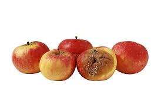
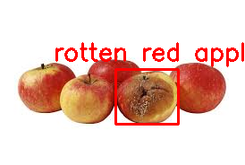
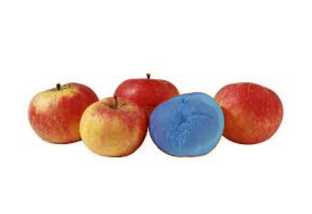

# Apple Detection and Segmentation

## Overview
This project focuses on the detection and segmentation of fresh and rotten apples, both red and green, using a combination of the YOLOv11 object detection model and the Segment Anything Model (SAM). The objective is to accurately identify and differentiate between fresh and rotten apples, making it easier to manage apple quality in various applications such as agriculture, distribution, and retail.

## Table of Contents
- [Features](#features)
- [Getting Started](#getting-started)
- [Installation](#installation)
- [Usage](#usage)
- [Model Training](#model-training)
- [Results](#results)
- [Contributing](#contributing)
- [License](#license)

## Features
- Traing YOLOv11 model on fresh and rotten apples.
- Detection of fresh and rotten apples with high confidence (90%+)
- Effective segmentation using the SAM model
- Support for both red and green varieties of apples
- Visualization of detection and segmentation results

**Original Image:**

**Rotten Detected Image**

**Rotten Segmented Image**

